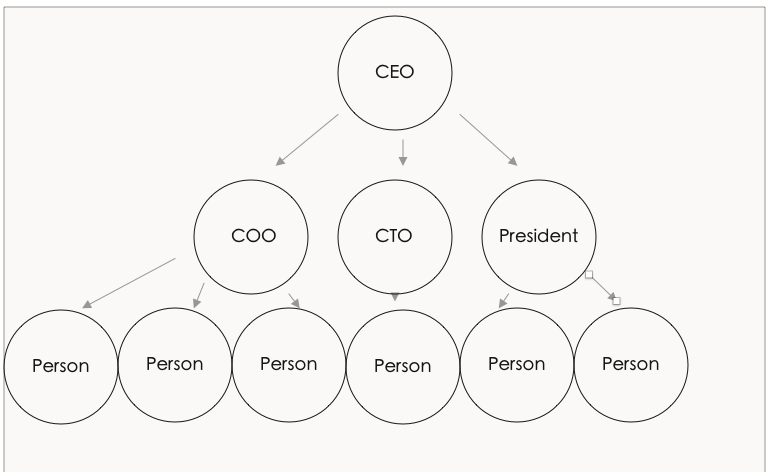
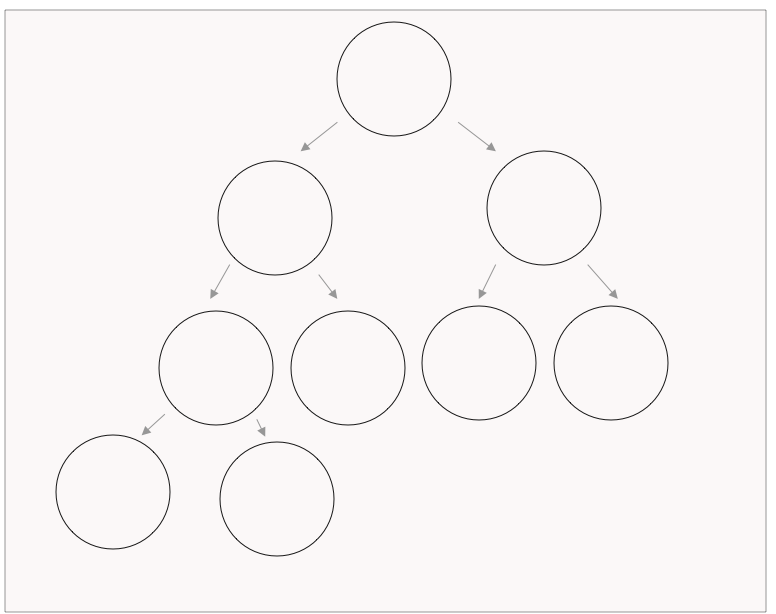

## Data Structures Review & Intro to Trees

From the real world

- Imagine a dictionary - it is a reference full of data. It is structured alphabetically, often with pages indexed for better searching.
- Imagine a map - it is a reference full of data. It is structured using 2D planes, made up of geometric shapes with scales and directions
- Imagine a ledger - it is a reference full of data. It is usually structured by date, with the same rows and columns, with an area to tabulate totals.

From the above - which is 'the best' data structure?

> Each serve a specific purpose. They are the best for the goals that they serve.

---

From programming
So far, we know about

- Arrays
- Objects

By now, we have a good sense of when to use one or the other.

Let's say we want to create a company's employment hierarchy.

- We have the CEO at the top
- The CTO, COO, and President reporting to the CEO
- Each of the above members has 3-4 people reporting to them
- And those people have 4-6 people reporting to them

Would you use an object or an array?

Taking a few moments, you'd find that both are a bit clunky and non ideal.

What would fit better would be a tree.

Trees are a different data structure than arrays or objects and they fit nicely for hierarchical relationships as above. They can also work for familial relationships, the DOM or the file structure on your computer.

There is no one great perfect data structure to fit all use cases. There are also simpler implementations and more complex ones, all depending on what problem you are trying to solve.

### Tree Terminology

Trees have nodes. Each node can branch off, these nodes are the children of the parent node. Nodes that share the same parent are called siblings. Nodes that are on the same level but do not have a common parent are NOT siblings.

The topmost node is called a root. A node that has no children is called a leaf

Trees have depths/heights based on the number of nodes that branch off of the root node.

### Binary Tree

A binary tree is a tree that has a constraint that there can only be a maximum of 2 nodes off of each node

---

How a binary search tree operates :

1. First of all - the values are sorted,
2. Second of all, once you enter a node you can ignore the rest of the tree.

### Activity

#### Activity 1

Let's make a list of 10-12 numbers ranging from 1 - 100. Let's take a few volunteers to call out some numbers

We'll cheat just a little and pick one 'middle'-ish number to be our root. Then let's sort our numbers in a binary tree.

Let's draw this out on a whiteboard. Let's take some volunteers to call out a few animals.

#### Activity 2

Let's do the same thing this time we'll sort animals alphabetically.
