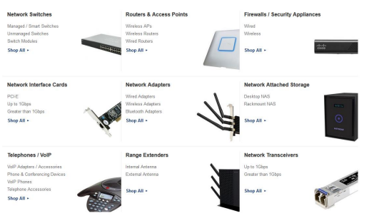

# 1. Identify the uses of the network

- Network planning phase
- Determine why the organisation needs a network
- Find out via interviews.
- How can a network help the business
- the more you find out about the business the better

# 2. List which tasks execute on which computers

- Know which applications and tasks have to be performed at each of the computers on the network.
- need to know how powerful each computer should be and what each computer should be capable of (CPU,RAM, HD Space, Monitor size)
- same for both server and client computers.
- Eg, computer for data entry vs computer for video editing.

# 3. Select the type of network: Centralised or not?

- Peer-to-peer network suffice or require a client server architecture
- Types of server services:
  - File server, print server, email server,a pplication server, webserver, database server, auth server, backup server, etc
  - In-house Physical server? or Cloud baased Infrastructure as a service? (IaaS)
    - Multiple Physical Servers in house or a single server Utilizing virtualisation?
    - Utilisation of a Cloud Provider: AWS, Azure etc

# 4. Select the proper equipment

Determine what networking equipment is right for the custom-tailored network design.  
Consider the budget
Consider the reliability, security, availability and scalabilty requirements.

## Cloud computing

- SaaS
  - Office 365
  - Sharepoint Online
- IaaS
  - AWS
  - Azure
- Cloud based DataStorage & Backups
  - Microsoft OneDrive
  - DropBox
  - iCloud

\*\* Concerns: Security, HIPA-certified(Healthcare), PCI-DSS(Payments), etc

# 5. Draw the network

- Physical layout of IT equipment (blueprint)
- Logical layout of IP addressing schema

# 6 & 7. Write the specification & Built it

The purpose of the specification document is:

- To limit the scope of the network design; prevents scope creep
- To provide a reference document for network administrators

Should Include:

- Why the organization is building the network
- What the network will be used for
- How many people and computers the network will support
- If the network is peer-to-peer or client-server
- The response time and throughput requirements
- The security requirements (physical and logical)
- The reliability requirements (availability)
- The scalability requirements
- Specifications & justification for all hardware and software
