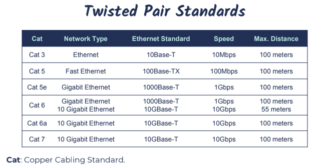

# Network Cabling

- Coaxial
- Twisted pair
- Fiber Optic

#### Eternet

Eternet is a network protocol that controls how data is transmitted over a LAN
reffered to as the IEEE 802.3 standard
supports networkd built with coaxial, twisted pair and fiber-optic cabling
originally it supported 10Mnps but latest supports much faster Gigabit speeds
Eternet uses CSMA/CD(wired/switch network) & CSMA/CA(Wireless) access methodology

Eternet uses an "xx Base T" naming convention: 10Base-T

- N: Signaling Rate ie, speed of the cable
- < signaling >: Signaling type: Baseband (Base) Communication
- X: Type of cable (twisted pair or fiber)

#### Coaxial cable

rarely used today, except cable modem connections

#### Twisted Pair Copper Cabling

4 twisted pair of wires with RJ-45 Connector
balanced pair operation

- - & - Signals
- equal & opposite signal
  Why twisted?
- to help reduce interference
- crosstalk
- noise (Electromagnetic Interference aka EMI)
  Potential signal emanations - can potentially capture the data
  Signal Attenuation(Reduction) after 100M Max distance.

#### shielded (STP) vs unshielded(UTP) & EMI

UTP - more susceptible to EMI
STP - less susceptible to EMI & crosstalk(if each pair shielded)

#### Roles of twist

Increased twist per inch:

- Reduces Crosstalk
- Increases signal
- Supports faster speed.

#### Straight through & cross over cable

Straight-through cable - connecting "unlike" devices

- Computer to switch
- switch to router
  Connecting "like" devices
- router to router
- computer to computer.

#### 10 base-T & 100 Base-T

Only green & orange pairs are used.

#### Gigabit Eternet (cat5e & faster)

ALL four pairs are used.
supports bi-directional data transfer.

#### Plenum-Rated Cabling

The Plenum is the open space above the ceiling or below a raised-floor
All network cabling placed in the plenum should be "Plenum rated cabling."
Non-plenum cable is a fire hazard.
The cable is made of PVC, if it burns or smolders it releases toxic fumes.
