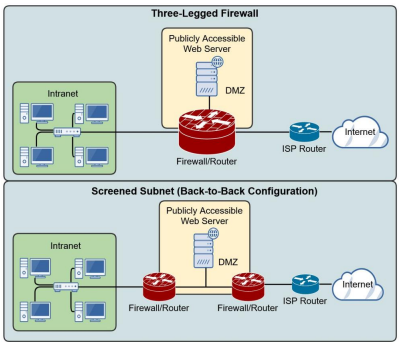

# Network Segmentation

## Network Address Translation

NAT translate private IP addresses, allowing us to map private IP addresses to public IP addresses:

- To help preserve scarce public IPv4 addresses
- To help increase network security
  With NAT, private IP address of a network device is hidden from devices outside of its LAN  
  There are three forms of NAT: Static, Dynamic and Port Address Translation (PAT)  
  Border network devices, such as routers, proxy servers and firewalls can utilise NAT

### Static NAT

1 to 1 relationship, where on private IP is statically confirgured to one public IP address  
Commonly used as a means to 'hide' the IP address of a publicly available device, such as a web server

### Dynamic NAT

Many to many relationship, where many private IP addresses have access to a pool of public IP adresses.  
If the pool of IP addresses is all in use, other devices in the local private network must wait for them to become available.

### PAT

Many to 1 relationship, where all devices ont he local private network utilises a single public IP address.  
Ports are used to link each connection to a specific dynamic port number  
very common in small business and home networks

## Demilitarised zone (DMZ)

A perimeter network designed to be securely seperated from an organisation's private internal network (intranet)  
commonly called a DMZ  
allows untrusted users outside an organisation's LAN to access specific services located within the DMZ

- Public web sites
- trivial FTP server for file downloads
- Public email services (gmail, etc)
  Also blocks such users from gaining access to the oranisation' intranet

## Port forwarding

A technique used to allow external devices to access to computer services within a private network.
Example: Web server in your home network.

Map an external IP address port number to a specific internal IP address and port number.
Example: Forward all port 80 requests to your public router IP address to your web server in your home network.

## Access Control Lists (ACLs)

Access control lists are a network security feature used to create allow/deny network rules to filter network traffic  
They can be set for both incoming and outgoing traffic on a variety of devices, such as:

- Routers
- Firewalls
- Proxy servers
- End devices
