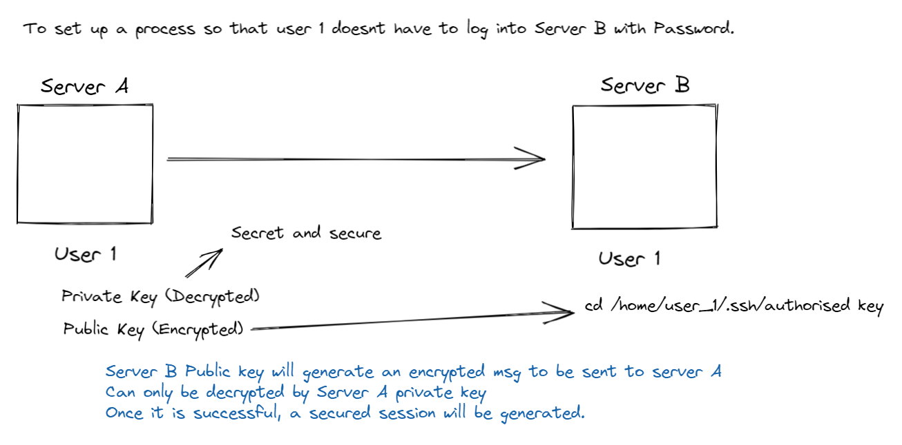

# Configuring and Securing SSH

## Open SSH

Open SSH - to make secure and encrypted communication over a computer network.
OpenSSH is not a protocol
It is a set of computer programs that uses SSH protocol

#### Why SSH > FTP/Telnet?

All users and communications and user credentials using OpenSSH are encrypted, and also protected from man in the middle attacks.

## SSH Hotkeys

SSH secures communication through public-key encryption. When an SSH client connects to an SSH server, the server sends a copy of its public key tot he client before the client logs in. This is used to set up the secure encryption for the communication channel and to authenticate the server to the clients

Server being accessed:  
`/etc/ssh/ssh_host_ecdsa_key.pub` - contains the public key  
Will give the public key to the user trying to access:  
The given public key will be saved in:  
`/home/shar/.ssh/known_hosts`

edit `/etc/ssh/ssh_config`  
`StrictHostKeyChecking Yes` - if the public key and known host key doesnt match, the process will be immediately aborted.

## SSH Key based Auth

## How to generate Keys and Copy Keys

Host Server to generate Public and Private keys

> `ssh-keygen`

`ssh-copy-id user_1@serverb`

> Do it from the server that wants to connect to another server to implement something.

## OpenSSH config file

> /etc/ssh/sshd_config

1. Disable RootLogin `PermitRootLogin no`
2. Allow only specific users `AllowUsers`
3. Deny Specific Users `DenyUsers`
4. Changing SSHD port `Port 222`
5. Change Login Grace Time `LoginGraceTime 1m` (Default 2m)
   - when you ssh to a server, you have 2m to login,if no successful login after 2m, ssh will disconnect.
