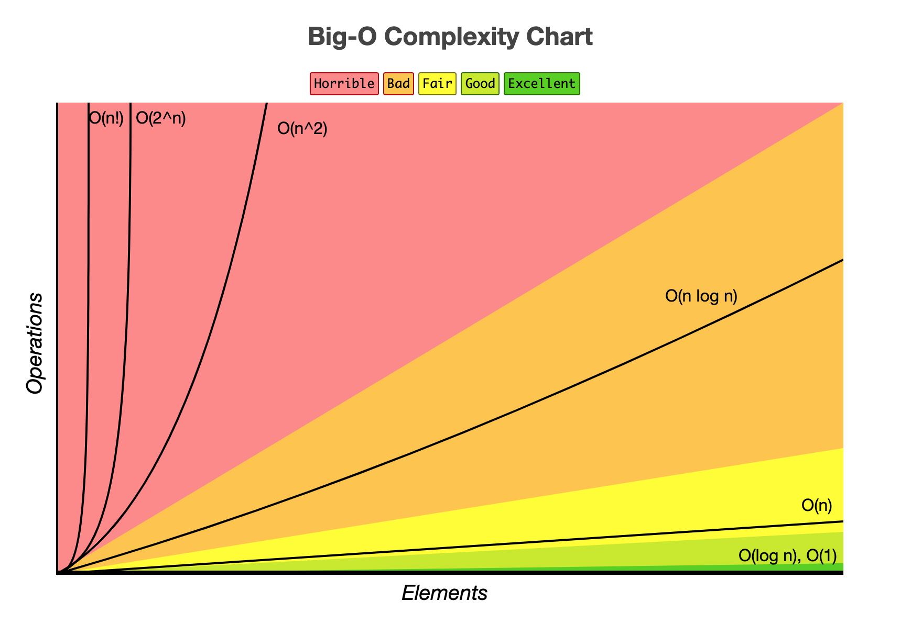
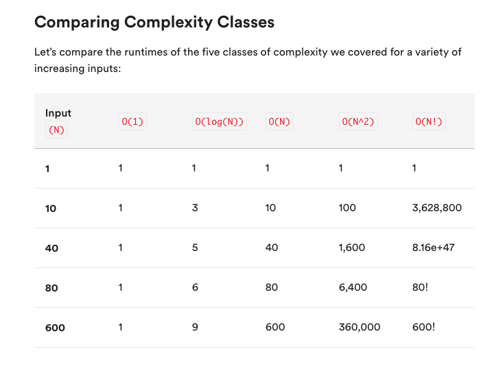

# Big O Notation

[bigOcheatsheet](https://www.bigocheatsheet.com/)

Big O of Algorithms is measured by:

Time complexity - the amount of time it takes to execute. It is measured in the number of steps an algorithm takes rather than measures of time like seconds or minutes.
Space complexity - the amount of memory (RAM) required an algorithm needs to run.
Each complexity can be described with notation like O(n): Where n represents the number of elements.
Additionally, Big O can be represented visually with the execution time/memory on the y-axis and input size on the x-axis.

---

## Class of Complexity



### Constant O(1)

```js
const getFirstSongFromPlaylist = (array) => {
  console.log(array[0]);
};
```

This algorithm has a Big O complexity of constant. No matter the size of the array 1 or 1 million, this always takes the same amount of time and memory to execute.

This type of complexity is considered highly efficient.

---

### Linear O(n)

```js
const printSongs = (array) => {
  for (let i = 0; i < array.length; i++) {
    console.log(array[i]);
  }
};
```

This algorithm has a Big O complexity of linear. For each added song to the array, the amount of time it takes to complete this is increased by 1 step.

If the array (or playlist) has 1 item, it will take 1 step to complete. If the array has a million items it will take a million steps to complete.

This type of complexity is considered pretty good efficiency.

---

### Quadratic Complexity O(n^2)

```js
const PrintSongsWithinAlbums = () => {
  for (let i = 0; i < array.length; i++) {
    for (let j = 0; j < array.length; j++) {
      console.log(array[i][j]);
    }
  }
};
```

This algorithm has a Big O complexity of quadratic. For each added item to the array, the amount of time it takes to complete this is increased by n to the n power!

This type of complexity is considered inefficient.

---

### Logarithmic Complexity O(log(n))

```js
function binarySearch(arr, item, first = 0, last = null) {
  if (!last) last = arr.length;
  let midpoint = Math.floor((last - first) / 2) + first;
  if (arr[midpoint] === item) return midpoint;
  if (arr[midpoint] > item) return binarySearch(arr, item, first, midpoint);
  if (arr[midpoint] < item) return binarySearch(arr, item, midpoint, last);
}
```

So we start in the middle, let's say that this middle is songs that start with the letter M, if our song starts with the letter I we can eliminate all the songs that start with M or further in the alphabet. Now we've cut down the number of items we must search by half.

Let's set our next midpoint to be the middle of the remaining songs, and we get songs that start with the letter F. Since our song starts with the letter I, we can stop searching through songs starting with A - F, and have again, cut our search down by half.

We would keep repeating, removing half of the songs we are looking through until we found our song. This more complicated process is more efficient than looking through every single song and can be represented

In this way, if we have 16 songs, the number of steps would be 4 Log(2) of 16 = 4.

If we have about 1.126 million songs, the number of steps would be just 50!

This type of complexity is considered highly efficient.

---

### Factorial Complexity O(n!)

Factorial means the product of all positive integers less than or equal to n.

Examples

3 factorial is 3 x 2 x 1
7 factorial is 7 x 6 x 5 x 4 x 3 x 2 x 1
The complexity of an algorithm that is factorial increases faster than any other example. While there are real world examples of these types of algorithms, due to their complexity, they are not typically asked in coding interviews for jr positions and thus we won't include an example.

This type of complexity is considered inefficient.


