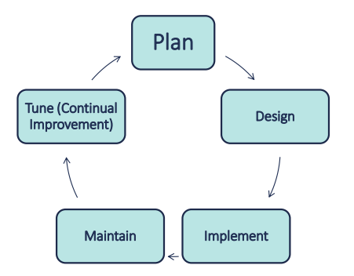

# Network planning

Many small/medium business utilize an adhoc network design with a break-fix mentality
can lead to :

- Troubleshooting issues
- Scalability issues
- Reliability issues
- Security issues
- Data loss issues
- Costly repairs.

Business downtime -> Decreased revenues & profitability, Tarnished reputation and loss of customers.
(Max business downtime)
Keeps process focused and organised
Good plans produce the best results
clients and employers expects it

## The Overall Process

## Understanding the business

** Business and Regulatory Requirements drive Technical Needs
** What are the Business's core and Strategic Competencies?

- Business Process Analysis: <b>Understand business processes</b>
- Business Impact Analysis: <b>Define Essential Business Processes</b>
  Key essential processes for the business
- Key stakeholder interviews: <b>Analyses Established via interviews</b>
  CEO, CFO etc, groud staff, help better define the point above.
- Examine Regulatory Requirements: <b>Review all regulatory requirements.</b>
  Legal/ regulatory obligations

## Establishing Business needs

- Increased Operational Efficiencies via Business PRocess Improvement.
- Decreased IT and Operational costs
- Increasing Profitability ie. Bottom Line
- Ensure we mee Regulatory Requirements
- Increased Network Security Posture
  Where is the positive ROI(Return On Investment) coming from?

## Specific area of improvement

- Improved Communication and data sharing
  - Knowledge base Software or services
  - Interoffice Chat System (Video/Audio)
  - Voice over IP (VoIP) Phones
- Automated Business processes
  - Digitize antiquated paper-based processes
  - Automate essential business processes
  - Automate reporting with on demand dashboards.
- Business Intelligence solutions
- Implementing of a data back up and restorable
- Enhanced Information Security
  - Better protect company against network and data breaches

## Hidden Costs

Planning a network invovles more than just:

- Designing the physical and logical network
- planning equipment purchases
- selecting necessary softwares

Network Change the way people work (Process Improvement & Change Management)

- Resistance to change and instituting change management
- Training cost ( end-users and administrators)
- Documentation & ongoing support costs
- Transition planning

## Planning questions

- Network Type
- Network cabling
- Printer requirements
- Email requiremnets
- Data requirements
- Network Security Requirements
