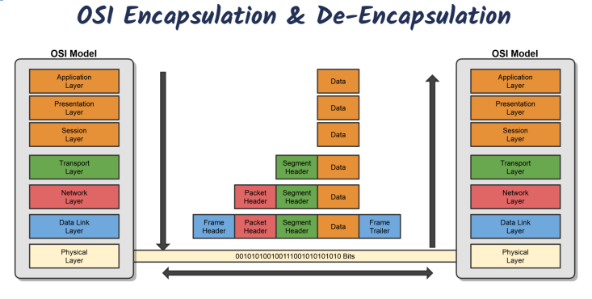
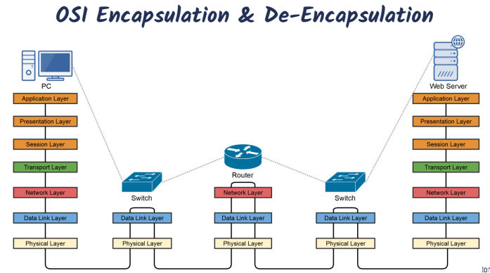

# OSI Model

| Layer type  | Num | Name of Layer |  Data   |
| :---------: | :-: | :-----------: | :-----: |
| Host Layer  |  7  |  Application  |  Data   |
| Host Layer  |  6  | Presentation  |  Data   |
| Host Layer  |  5  |    Session    |  Data   |
| Host Layer  |  4  |   Transport   | Segment |
| Media Layer |  3  |    Network    | Packet  |
| Media Layer |  2  |   Data Link   |  Frame  |
| Media Layer |  1  |   Physical    |   Bit   |

## Layer 7 - Application Layer

Network process to Application

This is where users interact with the computer, acts as an interface between and application and end-user protocols.
Applications doesnt reside in the application layer but instead interfaces with application-layer protocols.
Example Application layer protocols:

- Email: IMAP4, POP3, SMTP
- Webbrowsers: HTTP, HTTPS
- Remote Access: SSH, Telnet

## Layer 6 - Presentation Layer

Data Representation & Encryption

Ensures that data transferred from one system'S app layer can be read by the application layer on another one
Provides character code conversion, data compression and data encryption/decryption
Example:

- Google chrome HTML converted to ASCII Format
  Layer 6 file formats:
- Web browser: HTLM, XML, JS
- Graphic file: JPEG, GIF, PNG
- Audio/Video: MPEG, MP3
- Encryption: TLC, SSL
- Text/Data: ASCII, EBCDIC

## Layer 5 - Session Layer

Interhost Communication

Responsible for setting up, managing, and then tearing down sessions between network devices
Ensures data from different application sessions are kept separate.
Coordinates communication between systems. ( Start, Stop, Restart )
3 Different methods of communication between devices:

- Simplex
  one way communication between 2 devices ( listening to a radio station)
- Half Duplex
  2 way communication between 2 devices, but only one can communicate at a time.
- Full Duplex
  2 way communication between 2 devices, both can communicate at the same time.

## Layer 4 - Transport Layer

End-to-End Connection & Reliability
Ensures that data is delivered error-free and in sequence
segments data and reassembles correctly.
can be connection oriented or connectionless.
considered the " Post Office" Layer

- (TCP) Transmission Control Protocol
- (UDP) User Datagram Protocol
  Responsible for 2 data flow control measures:
- Buffering - Stores data in memory buffers until destination device is available.
- Windowing - allows devices in session to determine the "window" size of data segments sent

## Layer 3 - Network Layer

Path determination & IP (Logical addressing)

THe 'routing' layer
Provides logical addressing ( IP Addressing) and routing services

Places 2 IP addresses into a packet:

- Source address & Destination IP Address

Internet Protocol(IP)

- The Primary network protocol used on the Internet, IPv4, IPv6 Logical addresses

Data Packets

- Routed IP data packets (IPv4, IPv6)
- Route-update Packets (RIP, OSPF, EIGRP etc)

Devices & Protocol

- Routers & Multi-layer switches
- IPv4 & IPv6
- Internet control message Protocol (ICMP) ie Ping

## Layer 2 - Data Link Layer

MAC & LLC (Physical Addressing)

The Switching layer
Ensures that messages are delivered to the proper device on a LAN using hardware addresses

- MAC address
- Only concerned with local delivery of frames on the same network

Responsible for packaging the data into frames for the physical layer
Translate messages from the network layer imto bits

#### LLC (Logical Link Control)

Error control and flow control

- detect and correct corrupted data frames
- limits amount of data sent so devices are not overwhelmed.

#### MAC (Media Access control)

Physical addressing

- 48-bit MAC address burned in NIC

Logical Toplogy and media Access

- Eternet, token ring, etc
- CSMA/CD & CSMA/CA

## Layer 1 - Physical Layer

Miedia, Signal and Binary Transmissions

Defines the physical and electrical medium for network communication

- sends bits and recieves bits(1 or 0)
- Encoding Signal types
  Electricity, radio waves, light
- Network cabling, jacks, patch panels, etc
  Copper or fiber
- Physical Network Topology
  Star, mesh, ring, etc
- Eternet IEEE 802.3 Standard
- Layer 1 equipment
  Hubs, media converters, modems
  Responsible for the network hardware and physical topology

## OSI Encapsulation & Decapsulation

