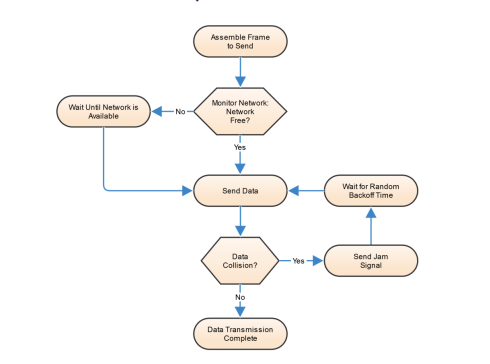
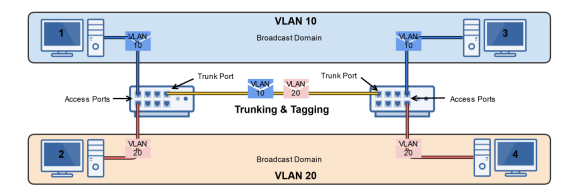

# Switches

## Collision Domains

A collision domain is simply a network segment in which data collisions can occur
Collision can occur on eternet network using:

- Hubs
- Switches in Half-Duplex mode
  Utilise CSMA/CD to help minimize collisions

#### Hubs

creates on large collision domain.

#### Switches(Half duplex)

Breaks collision domains up into smaller ones.

#### Switches (Full -duplex)

Collisions dont occur on switches utlising full duplex mode

- theres a dedicated channel for concurrent sending and recieving data

## Broadcast Domains

Broadcast domain is a network segment in which devices on that network recieve eternet broadcast messages (one-to-all) from each other

- ARP, DHCP

Hubs and switches forward broadcast messages, routers do not.

- broadcast messages are very inefficient and resource-intensive
- if router allows broadcasts, WAN and internet performance would drastically decline due to broadcast storms

## CSMA/CD

used on a shared network medium to help reduce data collisions
helps host decide when to send data and also detect collisions
used with hubs(multiport repeaters)
used with switches ONLY in Half-duplex modes

## Managed vs Unmanaged Switches

#### Unmanaged switch

- completely unmanaged

#### Managed switch

Can be configured and managed by network administrators typically via telnet or SSH - Confirgure static entries in the MAC table - Configure half or full-duplex on specific ports - monitor performance with SNMP - Create VLANs(Virtual LANs) - Configure port mirroring
Much more expensive than unmanaged switch

## How a switch learns MAC addresses

1. Host A sends eternet frame to Host B
   - Source: AAA, Destination: BBB
2. Switch records that Host A's MAC Address is on Port 1 in its MAC Address Table
3. Switch doesn't know what port port HostB is using, so it will flood parts 2 and 3 (broadcast)
4. Host B & C will examine the Eternet frame.
   Host C will discard it.
   Host B will respond to Host A
5. When Host B responds, the switch will record HOst B's MAc address on Port 2
6. The Switch already knows that Host A is on Port1, so it will forward the Eternet frame to port 1

## Virtual LANs

Essentially LANs within a LAN

- Physical switch -> Multiple Virtual Switches

Breakup a large 'physical' LAN into several smaller 'logical' LANs
Assign specific Switch interfaces(ports) to specific virtual LANs
Benefit of virtual LANs

- Reduces Broadcast Domains
- Segments Network by Role
- Increases Security
- Devices cannot communicate with other VLANs
- Group devices by need, not physical location

### VLANs with multiple switches

- Trunk Ports
  creates a connection between 2 switches (trunk link) for VLAN traffice to traverse for multiple VLANs
- Access Ports
  Ports configured for use for a single VLAN
- Tagging (802.1Q)
  Eternet frames are tagged with their respective VLAN ID when transversing trunk ports to ensure proper delivery
- Untagged Frames
  If a frame isn't tagged with a VLAN ID, switch trunk ports can be configured with a native VLAN, to which the untagged frame will be sent

## Layer 3 Switches

Provide Layer 2 Switching & Layer 2 Routing
Managed Switch Capability
Used in conjunction with VLANs
Provides: VLAN Switching, IP routing between VLANS
One device instead of Router & Switch

## Port Mirroring

When a switch is configured to have a dedicated port recieve all traffic on that network for

- Monitoring
- Diagnostics
- Troubleshooting

Also called a Switch Port Analyzer(SPAN)

## Power over Eternet (AoE)

Gives us the ability to power net-work-connected devices with Eternet cables:

- VoIP Phones
- Wireless Accesspoints
- IP security Cameras

Provides eelectricity and network data in the same cable
Two methods: PoE switch, Non-PoE Switch + PoE injector
