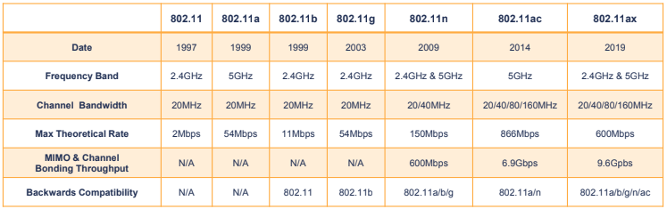

# Wireless Networking

IEEE 802.11 standard for Wireless networking

- Traditional WLAN
  SOHO @ home
  WAP

- Point to Point (P2P) Wireless

Antenna strength is measured in dBi, the higher the dBi, the further distance the signal will travel

#### Service Set Identifier (SSID)

SSID is the wireless network name  
SSID broadcasting can be disabled for network security reasons.

#### CSMA/CA

With wireless networks, its more difficult to detect collisions, so CSMA/CA tried to avoid them with Request to send(RTS) and Clear To Send(CTS)

## Service types

#### Adhoc mode

#### Independent Basic Service Set (IBSS)

#### Infrastructure Mode

- Basic Service Set(BSS)
  Single WAP  
   Most common config
- Extended Servce Set (ESS)
  Multiple WAP, utilising the same SSID

## Wireless Frequencies and channels

Wireless signals occupy a spectrum of frequencies:

- signals that vibrate slowly have a low freq
- Signals that vibrate quickly have a high freq

```
EG:

- AM Radio: 10MHz
- PM Radio: 100MHz
- Microwave Oven: 2.4GHz
- Cordless Phone: 2.4GHz
```

802.11 Wireless operates at either 2.4GHz or 5GHz

This also operates on a channel, whic is a portion of 2.4GHz or 5GHz spectrum

##### 2.4GHz Band

- composes of 14 overlapping 20MHz channles. Due to licensing laws:
  - only channles 1 through 11 are available in US
  - most other countries allow channle 12 and 13
  - Channel 14 is only available in Japan
- Recommended to use channel 1, 6, 11 because these are the only 3 non overlapping channels

##### 5GHz

- Offers significantly more channels than 2.4GHz
- roughly 40 different non-overlapping channels
- Different countries have widely different rules for which channles can be used.
- 5GHz also features auto-channel switching

#### Channel Bandwidth

The Width of a channel is a channel's bandwidth  
expressed in MHz but equates to how many bits can be transmitted per second  
In 802.11, channle bandwidth varies from 20MHz up to 160MHz

#### Channel Bonding

When 2 adjacent channels are combined to increase bandwidth  
When channels are bonded together, their bandwidths doubles  
20MHz can be bonded to 40MHz, 80MHz or 160MHz channels

| 2.4GHz                                                                                                                       | 5GHz                                                                                                                                  |
| :--------------------------------------------------------------------------------------------------------------------------- | :------------------------------------------------------------------------------------------------------------------------------------ |
| Longer Freq Waves</br>- Prorogates through solid surfaces well</br>- Good solution for long-distances</br>-Slower data rates | Shorter Freq waves</br>- Less Effective penetrating solid surfaces</br>- Not as effective over long distances</br>- Faster data rates |
| Lower data rates over longer distances                                                                                       | Higher data rates over shorter distances                                                                                              |
| Fewer Channels</br>- 3 non-overlapping channels                                                                              | More Channels</br>- 24 Non-overlapping</br>- Channel bonding available                                                                |
| Suffers from freq congestion & interference</br>- Mircrowaves, cordless phones, and bluetooth operate at 2.4GHz              | Less congested than 2.4GHz freq</br>- Freq congestion and interference isnt a big issue                                               |

## 802.11 standards



### MIMO

Multiple input multiple output

- Wireless technology that uses multiple antennas to increase data transfer speeds
- Requires multiple antennas on the WAP and wireless NIc
- Wireless devices can make multiple simultaneous connections to a Wifi router utilising several antennas
  only one person can transmit data at a time
- commonly called Single-User MIMO (SU-MIMO)
- 802.11n utilises SU-MIMO

#### Multiple user MIMO(MU-MIMO)

802.11ac introduces the use of MU-MIMO  
MU-MIMO allows multiple users to communicate with a WAP at the same time  
Drastically improves network speeds and greatly reduces network latency

- as if each devices has its own WAP

## Deploying wireless networks

A site survey involves:

- analyzing the physical site via building bluepints
- performing a physical building walk through inspection
- using a wireless survey tool

#### Wireless survey tool

allows you to perform wireless network analysis and optimization

- Discover existing wireless networks
- Temporarily set up WAPs
- perform network heat maps to optimize
  - WAP placement
  - channel selection
  - antenna selection

#### Speed and distance requirments

- What speed does your WLAN need to support?
- How many concurrent users
- 802.11 backward compatibility requirments?
- Signal degradation and interference factors should also be considered

## Vulnerabilities & security

#### Essential

- Decrease its signal footprint
  - Lower its signal strength and/or range
- Implement a security protocol
  - WPA2 or WPA3
  - 802.1x (Centralized authentication)
  - DO NOT use WEP or WPA
- Change default Administrator password
- Implement Authentication
- Disable SSID Broadcasting
- Enable MAC Filtering
- Update firmware regularly

# Internet of Things (IoT)

describes embedding computing and networking capabilities into everyday objects

#### Z-wave

Wireless Protocol used for home automation  
Common Z-Wave Smart Devices:

- Smart Door lock
- Smart light bulbs
- etc

#### ANT+

designed to monitor sensor data that operates at the 2.4GHz freq bands
maintained by ANT+ Alliance, owned by Garmin
Common ANT+ devices:

- HR monitor
- BP Monitor
- Bicycle computers
- Bicycle power meters

#### Bluetooth

wireless protocol for PANs  
operates at 2.4GHz freq band  
market leader for short-distance wireless communications  
Common Bluetooth devices:

- Speakers
- Headsets

#### NFC (Near Field Communication)

enables 2 devices to transfer information over distances of 4cm or less  
most commonly used in 'tap to pay' payment systems

#### IR (Infrared)

has been aroudnf or a very long time  
uses infrared beams to send data transmissions with a limited range of generally 30 ft or less that requires a direct line of sight
Common IR devices:

- TV remotes
- thermometer

#### RFID (Radiofrequency Identification)

uses electromagnetic fields to automatically identify and track tags attached to objects  
commonly used for supply chain and inventory management purposes, as well as door access cards.  
Tags contain electronically-stored information and 'proximity readers' are able to read data stored on RFID tags

#### 802.11

Traditional Wifi can also be used for IoT application
