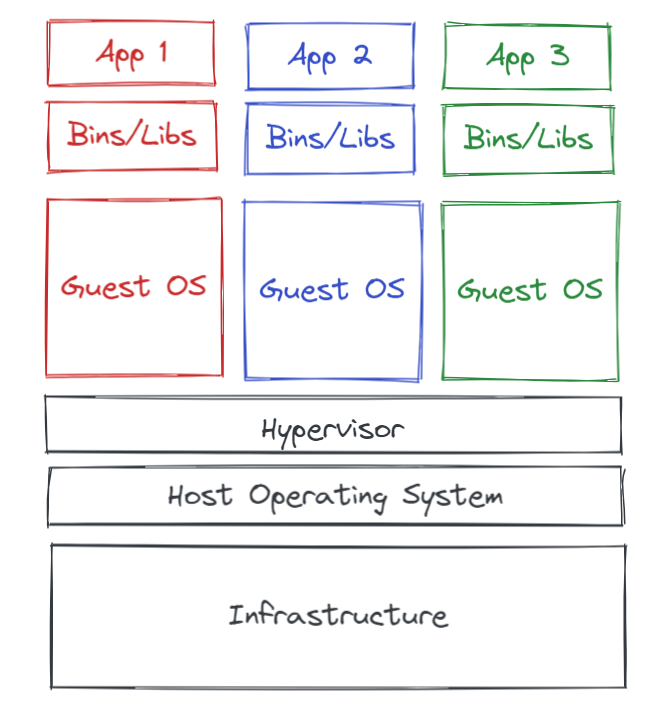
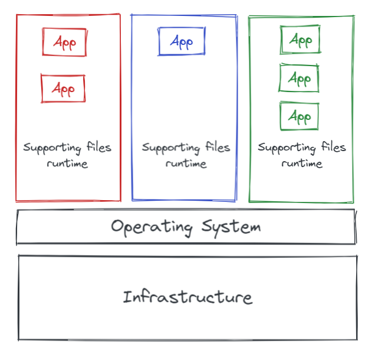

# Containers

## Virtualisation

Libraries, config files or services provided by their runtime environment  
Packaging systems like RPM are used to help manage application dependencies

The major drawback to traditionally deployed software applications is that these dependencies are entangled with the runtime environment  
An app might require versions of supporting software that are older ot newer than the software provided with the operating system.

VM's are bulky, each requires its own operating systems, so is typically gigabytes in size and difficult to maintain and upgrade.

## Containers

One way to resolve these conflicts is to package and deploy the app as a container.

A container is a set of one or more processes that are isolated from the rest of the system
Software containters are a way to package apps to simply deployment and management.

Run directly on the operating system, sharing hardware and OS resources accross all containers on the system.  
This enables apps to stay lightweight and run swiftly in parallel.

Require far fewer hardware resources than VM, which also makes them quick to start & stop and reduces storage requirements.

## Implementation of containers

- Control groups (cgroups) for resource management
- Namespaces for process isolation
- SElinux and Seccomp(Secure Computing mode) to enforce security boundaries

## Planning of containers

- Containers are an efficient way to provide reusability and portability of hosted apps
-
